<h1 align="center">🏥 Medical Cost Prediction 🏥</h1>

[](https://kedro.org)

## 🎯 Visión General

Este proyecto Kedro implementa un pipeline de ciencia de datos de extremo a extremo para predecir los costos de seguros médicos y clasificar a los pacientes en categorías de costo. La solución utiliza el conjunto de datos "Medical Insurance Cost Dataset", disponible en [Kaggle: Medical Insurance Cost Dataset](https://www.kaggle.com/datasets/mosapabdelghany/medical-insurance-cost-dataset), que contiene información demográfica y de salud de individuos. El pipeline ingiere estos datos crudos, los procesa para garantizar su calidad, entrena y evalúa modelos de regresión para predecir costos exactos, y modelos de clasificación para predecir si un paciente incurrirá en costos "Altos" o "Bajos".

El objetivo es demostrar un flujo de trabajo de Machine Learning estructurado y reproducible, donde cada paso, desde la limpieza de datos hasta la generación de reportes, está encapsulado en un pipeline modular y robusto.

---

## 🎯 Hipótesis

La hipótesis central es que las características demográficas y de salud de un individuo no solo permiten predecir sus costos médicos, sino también clasificarlo en un grupo de riesgo con alta precisión. Para validar esto, se plantearon las siguientes sub-hipótesis:

1.  **Hipótesis de Regresión (Predicción de Costo):**
    *   **¿Es posible predecir el costo exacto del seguro (`charges`)?** Se postula que un modelo de regresión podrá explicar una porción significativa de la varianza en los costos (R² > 0.75).
    *   **¿Cuál es el factor más influyente?** Se hipotetiza que ser fumador (`smoker`) será, por un amplio margen, el predictor más determinante del costo, superando a la edad y al IMC.
    *   **¿Existen efectos de interacción?** Se espera encontrar una fuerte interacción entre ser fumador y el IMC, donde el impacto del IMC en los costos se magnifica exponencialmente en individuos fumadores.

2.  **Hipótesis de Clasificación (Categorización de Riesgo):**
    *   **¿Se puede clasificar a los pacientes en categorías de costo 'Alto' o 'Bajo' con alta precisión?** Se anticipa que los modelos de clasificación alcanzarán una precisión superior al 90%.
    *   **¿Qué tipo de modelo será más efectivo?** Dada la complejidad y las interacciones no lineales (como la de `smoker` y `bmi`), se hipotetiza que los modelos de ensamblaje (Random Forest, XGBoost) superarán en rendimiento a los modelos lineales (Regresión Logística) y a otros clasificadores como SVC.

---
## 🏗️ Estructura del Proyecto

El proyecto está organizado en una serie de pipelines modulares, cada uno con una responsabilidad específica, garantizando un flujo de trabajo claro y reproducible.

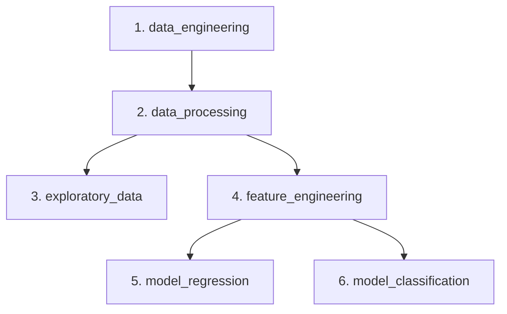
```mermaid
graph TD
    A[1. data_engineering] --> B[2. data_processing];
    B --> C[3. exploratory_data];
    B --> D[4. feature_engineering];
    D --> E[5. model_regression];
    D --> F[6. model_classification];
```

```text
src/medicalcost/pipelines/
├── data_engineering/     # 1. 📥 Descarga y carga de datos crudos desde Kaggle.
├── data_processing/      # 2. 🧼 Limpieza y validación de datos (nulos, duplicados).
├── exploratory_data/     # 3. 🗺️ Generación de gráficos para el Análisis Exploratorio de Datos (EDA).
├── feature_engineering/  # 4. 🛠️ Creación de características para modelado (One-Hot Encoding, etc.).
├── model_regression/     # 5. 📈 Entrenamiento y evaluación de modelos de Regresión (Lineal, RF, XGBoost).
└── model_classification/ # 6. 📊 Entrenamiento y evaluación de modelos de Clasificación (Log-Reg, SVC, RF, XGBoost).
```
</div>

---

## ⚙️ Flujo de Preparación de Datos

El preprocesamiento de datos es un pilar fundamental de este proyecto, automatizado a través de una secuencia de pipelines de Kedro para garantizar la consistencia y reproducibilidad. El flujo es el siguiente:

1.  **Ingesta de Datos (`data_engineering`)**:
    *   El pipeline se conecta a la API de Kaggle para descargar y cargar el dataset crudo, asegurando que siempre se trabaje con la fuente de datos original.

2.  **Limpieza y Validación (`data_processing`)**:
    *   **Manejo de Nulos y Duplicados**: Se eliminan sistemáticamente todas las filas que contienen valores nulos o que son duplicados exactos, garantizando la integridad del dataset.
    *   **Conversión de Tipos**: Las columnas `sex`, `smoker` y `region` se convierten al tipo de dato `category` para optimizar el uso de memoria y prepararlas para la codificación.

3.  **Ingeniería de Características (`feature_engineering`)**:
    *   **Creación de Variable Objetivo (Clasificación)**: Se crea la columna `cost_category` para los modelos de clasificación. Un paciente se etiqueta como `1` (Alto costo) si sus `charges` superan la mediana del dataset, y `0` (Bajo costo) en caso contrario.
    *   **Codificación One-Hot**: Las variables categóricas (`sex`, `smoker`, `region`) se transforman en formato numérico usando One-Hot Encoding con `drop_first=True` para evitar multicolinealidad.
    *   **Manejo de Outliers**: Se toma la decisión explícita de **no eliminar outliers**. Los valores extremos, especialmente en `charges` para fumadores con alto IMC, son considerados información predictiva crucial y no ruido.

---

## 💡 Resultados: Una Historia en Tres Actos

El pipeline generó una serie de reportes y visualizaciones que, en conjunto, nos permiten contar la historia de los datos y validar nuestras hipótesis. Cada artefacto es una pieza del rompecabezas.

### Acto 1: Exploración de los Datos

El análisis exploratorio (EDA) fue fundamental para entender la naturaleza de los datos y formular nuestras hipótesis. Cada gráfico nos contó una parte de la historia.

1.  **Perfil de la Población**: Primero, analizamos las distribuciones demográficas. La edad presenta una distribución bastante uniforme, el IMC (`bmi`) sigue una curva normal, y la mayoría de los asegurados tienen pocos o ningún hijo.

    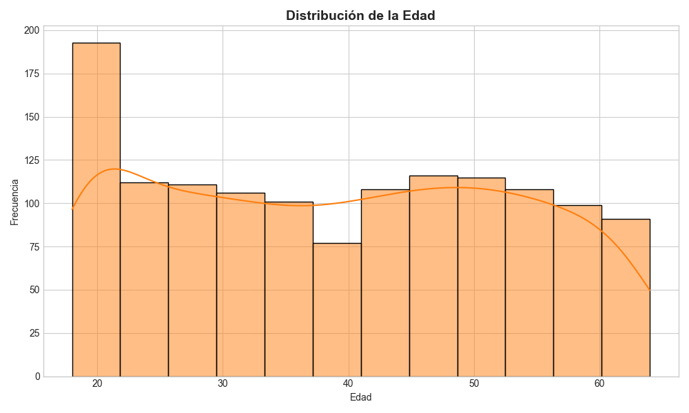
    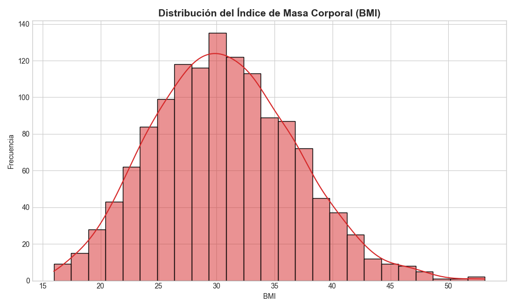
    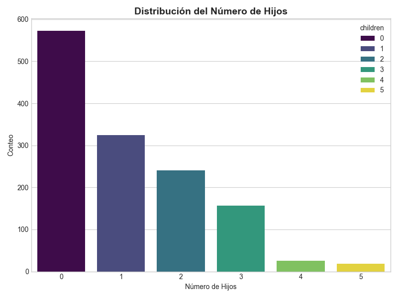

2.  **El Comportamiento de los Costos (`charges`)**: La variable objetivo muestra un fuerte sesgo positivo. La gran mayoría de los costos son bajos, pero existe una "larga cola" de costos muy elevados, lo que sugiere que ciertos factores pueden disparar los gastos de manera exponencial.

    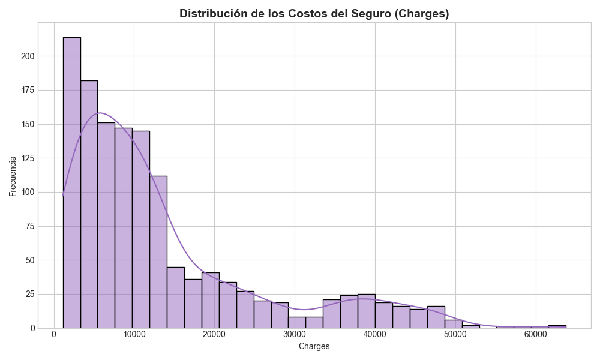

3.  **Búsqueda de Pistas: Correlaciones e Interacciones**:
    *   **Correlaciones Numéricas**: El mapa de calor inicial mostró correlaciones positivas pero débiles de la edad y el IMC con los costos. Ninguna variable numérica por sí sola parecía ser un predictor dominante.
    *   **El Factor Decisivo**: El gráfico de caja reveló la abismal diferencia en costos entre fumadores y no fumadores. Los fumadores no solo pagan más, sino que la variabilidad de sus costos es inmensa.
    *   **La Interacción Clave**: El gráfico de dispersión confirmó nuestra hipótesis de interacción. Mientras que un IMC alto aumenta los costos para todos, este efecto se magnifica exponencialmente en individuos fumadores.

    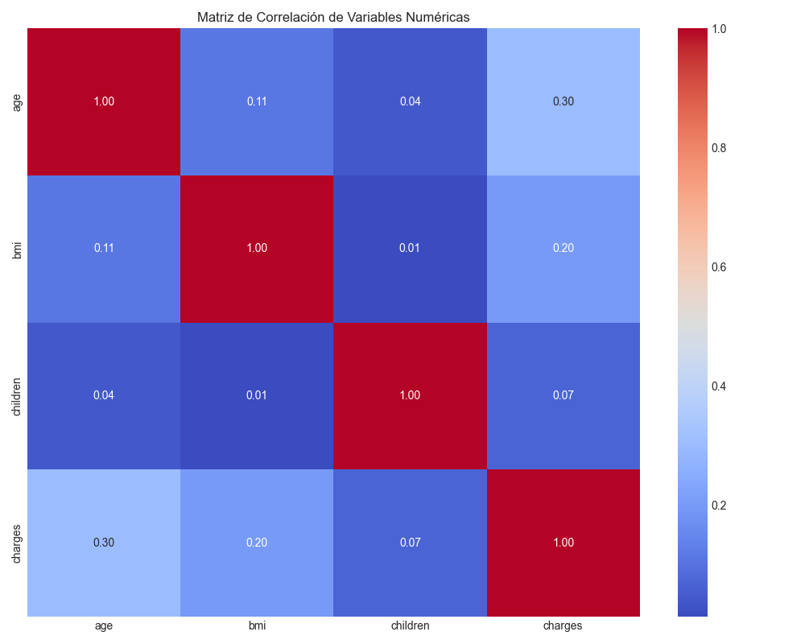
    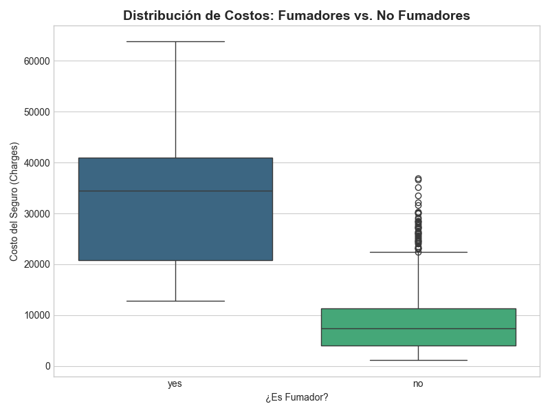
    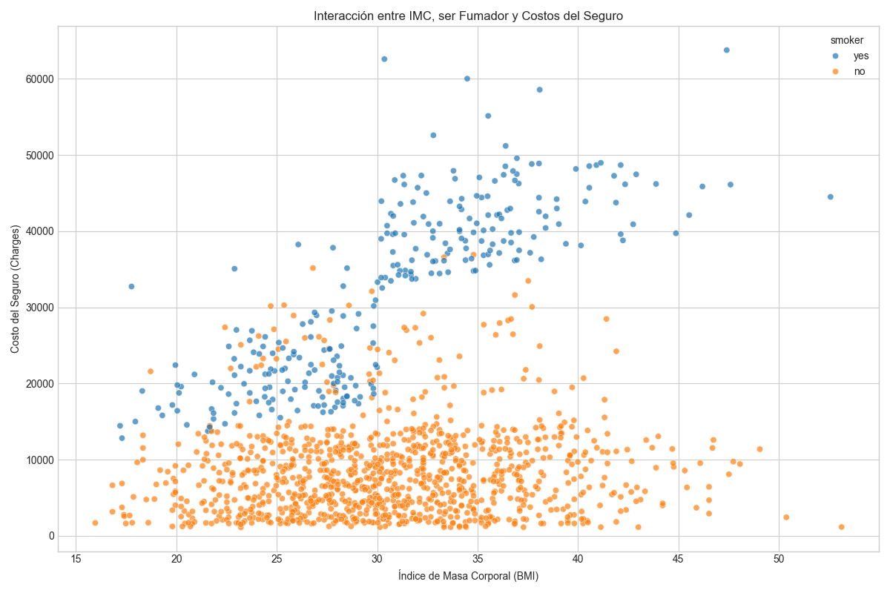

4.  **Relaciones Lineales Débiles**: Los gráficos de regresión univariada confirmaron que, de forma aislada, variables como la edad, el IMC y el número de hijos tienen una correlación positiva pero débil con los costos (R² bajos). Esto reforzó la idea de que las interacciones son más importantes que los efectos individuales.

    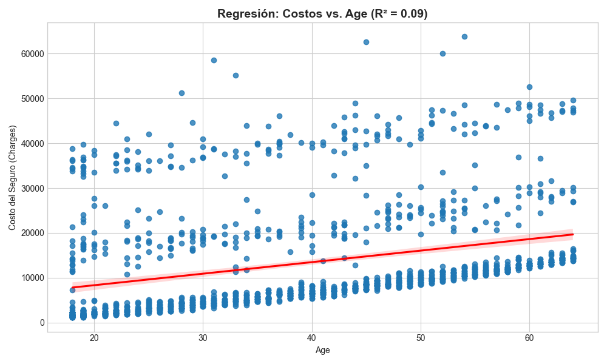
    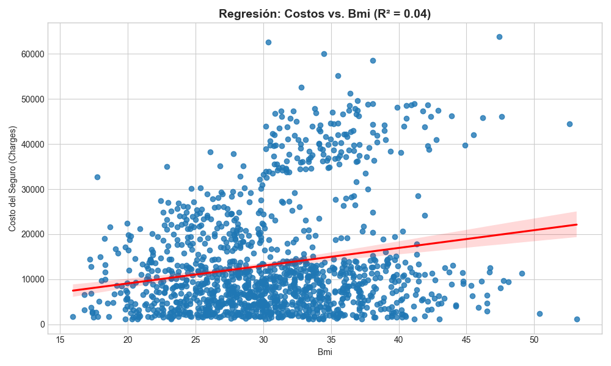
    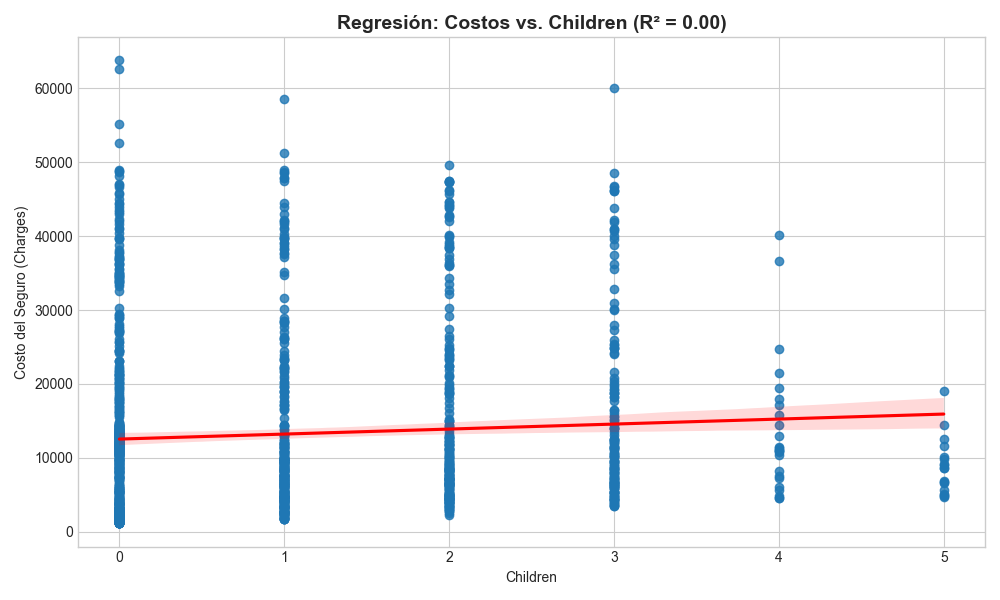

5.  **Análisis de Outliers**: Los diagramas de caja revelaron la presencia de valores atípicos, especialmente en el IMC y los costos. Se decidió conservarlos, ya que representan escenarios reales y de alto impacto (ej. fumadores con obesidad) que son cruciales para que los modelos aprendan a predecir los casos más extremos.

    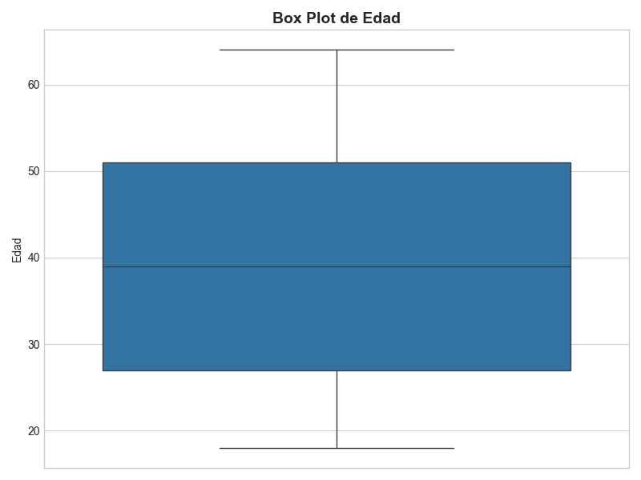
    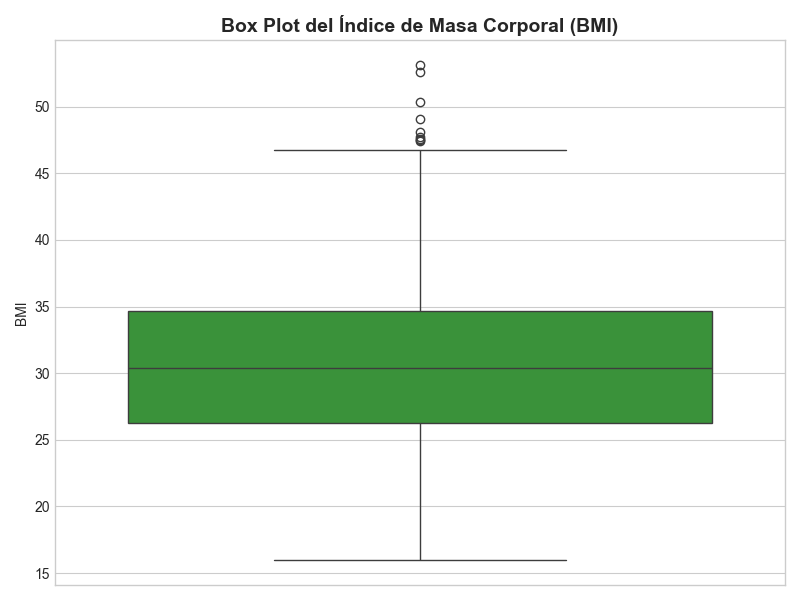
    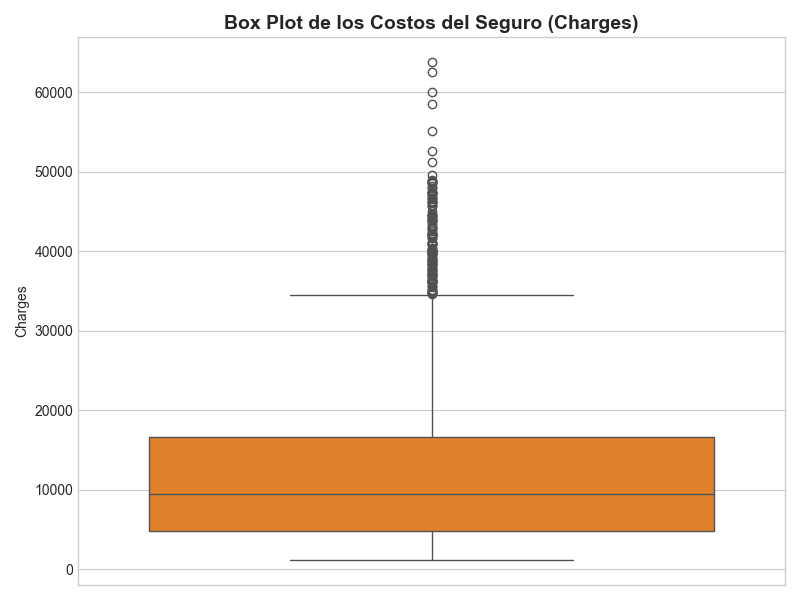

### Acto 2: Predicción del Costo Exacto (Regresión)

El objetivo aquí era responder: **¿Podemos predecir el costo exacto del seguro?**

1.  **Correlación de Características Finales**: Antes de entrenar, se generó un mapa de calor con todas las variables (incluyendo las dummies). Este mapa confirmó que `smoker_yes` es, con diferencia, la característica con la correlación más alta (0.79) con `charges`.

    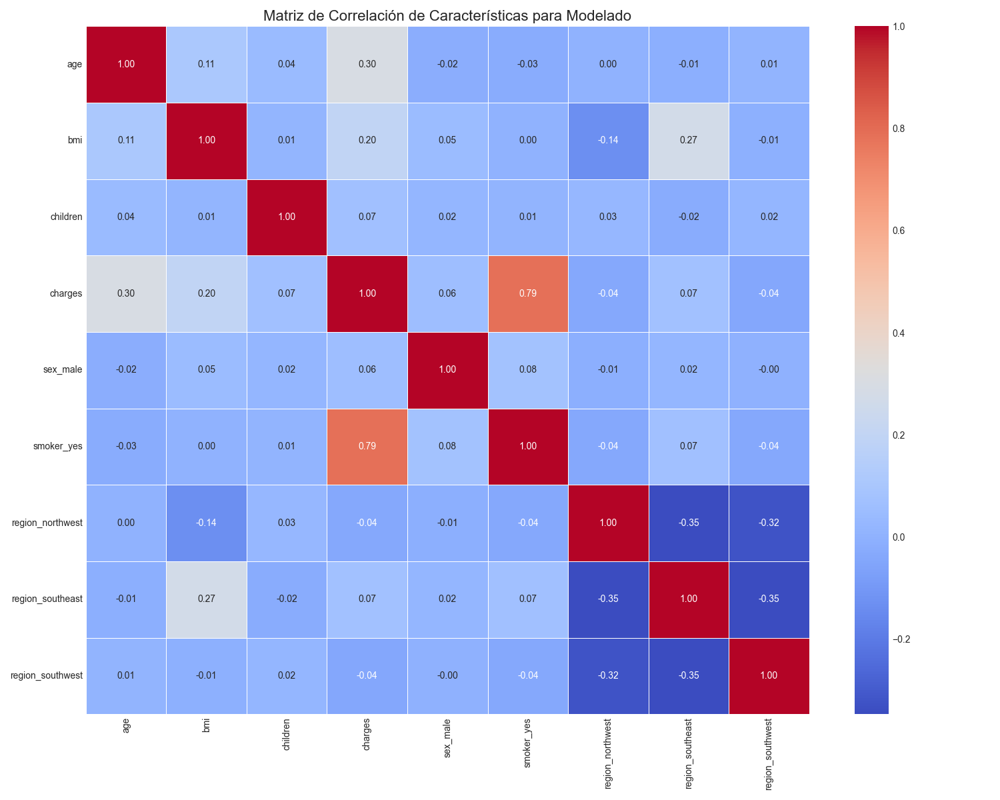

2.  **Comparación de Modelos**: Se compararon tres modelos, y los resultados, visibles en el gráfico `r2_comparison_plot.png`, confirmaron que los modelos de ensamblaje (Random Forest y XGBoost) superaron con creces al modelo lineal simple.

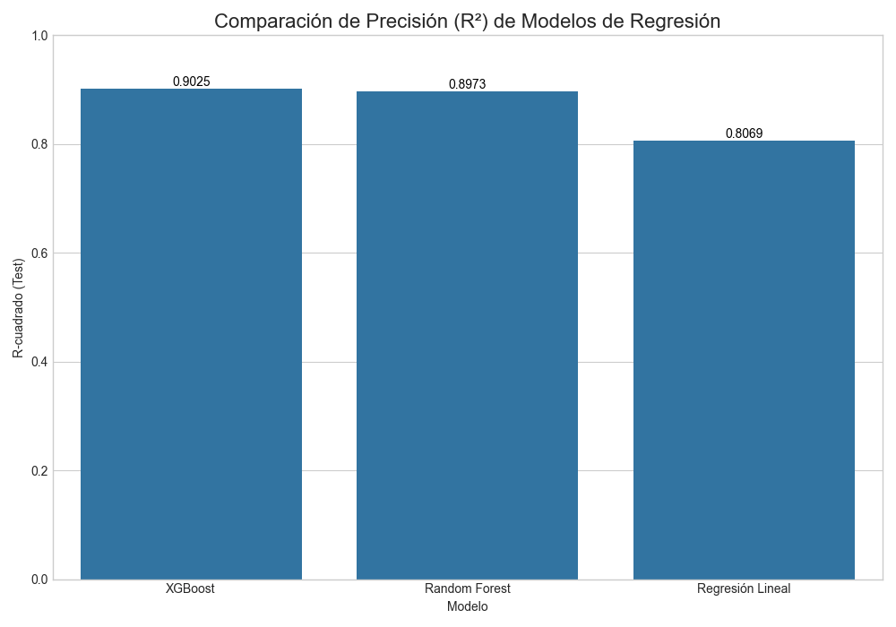

3.  **El Campeón y su Veredicto**: El modelo **XGBoost Regressor** se coronó como el campeón, explicando un **90.12%** de la varianza en los costos (R²). La importancia de sus características, extraída del reporte `evaluation_output_xgb.txt`, confirmó la hipótesis inicial de forma rotunda:

| Característica    | Importancia |
| :---------------- | :---------- |
| **smoker_yes**    | **0.7996**  |
| bmi               | 0.1026      |
| age               | 0.0457      |
| ... (otras)       | < 0.015     |

> ✅ **Conclusión de Regresión**: Es posible predecir los costos con alta precisión (R² > 0.90), y ser fumador (`smoker_yes`) es, por un margen abrumador, el factor más determinante.
> ✅ **Conclusión de Regresión**: Es posible predecir los costos con alta precisión (R² ≈ 0.90), y ser fumador (`smoker_yes`) es, por un margen abrumador, el factor más determinante.

### Acto 3: Clasificación del Riesgo de Costo (Clasificación)

Finalmente, se buscó responder: **¿Podemos clasificar a los pacientes en categorías de 'Alto' o 'Bajo' costo?**

1.  **Optimización de Modelos**: Para asegurar el máximo rendimiento, se realizó una búsqueda de hiperparámetros (GridSearch) para los modelos más complejos. Los mapas de calor generados nos permitieron visualizar cómo diferentes combinaciones de parámetros afectaban la precisión, eligiendo así la mejor configuración para cada modelo.

    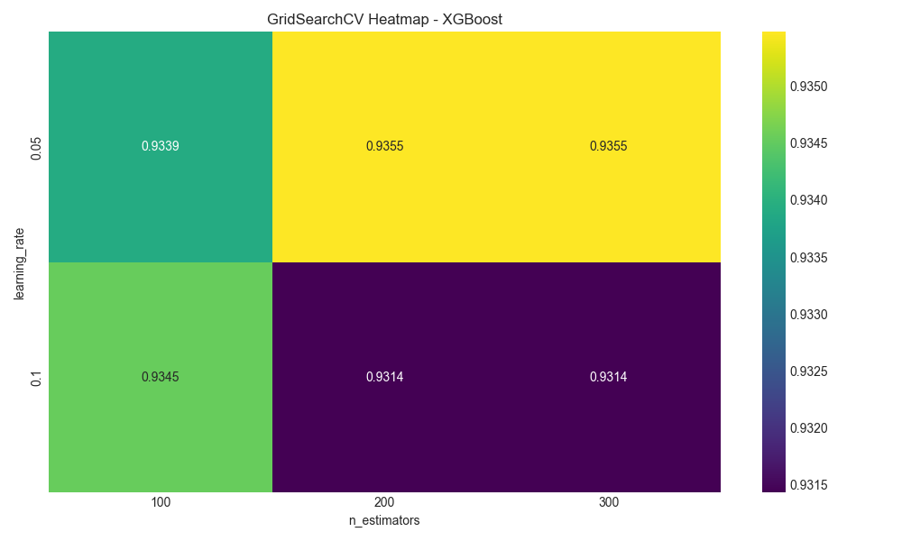

2.  **Rendimiento Final**: El resumen de rendimiento, generado en el dataset `classification_summary_output`, muestra una clara victoria de los modelos de ensamblaje, superando la meta del 90% de precisión.

| Modelo                          | Accuracy (Precisión Final) |
| :------------------------------ | :------------------------: |
| **XGBoost**                     |         **94.78%**         |
| Random Forest                   |           94.78%           |
| Support Vector Classifier (SVC) |           92.91%           |
| Regresión Logística             |           90.67%           |

> El modelo **RXGBoost** se corona como el campeón, logrando la mayor precisión en la clasificación de riesgo de costo. 🏆

3.  **Capacidad de Discriminación (Curvas ROC)**: La comparación de las curvas ROC confirma visualmente el rendimiento superior. Los modelos de ensamblaje y SVC se agrupan en la esquina superior izquierda, con áreas bajo la curva (AUC) de 0.95 o más, lo que indica una capacidad de discriminación casi perfecta.

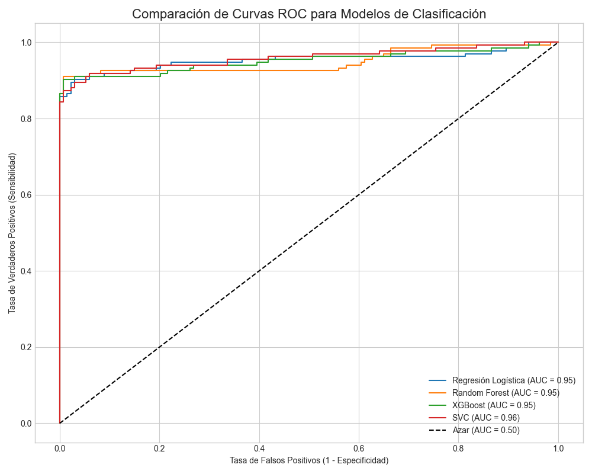

4.  **Interpretabilidad del Modelo Lineal**: Aunque la Regresión Logística no fue el modelo más preciso, su interpretabilidad es valiosa. El gráfico de importancia de características muestra que ser fumador (`smoker_yes`) tiene el impacto positivo más fuerte para ser clasificado como de 'Alto Costo', seguido por el IMC y la edad. Esto alinea los hallazgos de clasificación con los de regresión.

    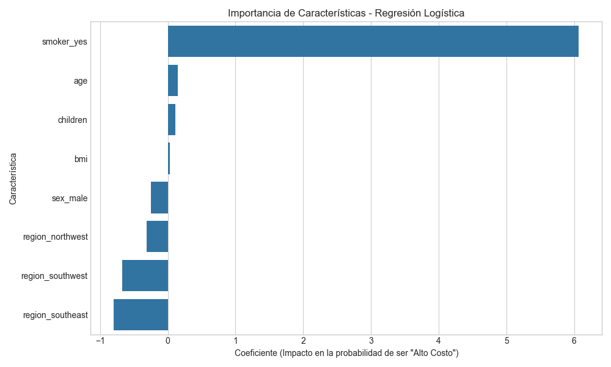

> ✅ **Conclusión de Clasificación**: Es posible clasificar a los pacientes por riesgo de costo con una precisión extremadamente alta (≈95%), y los modelos de ensamblaje son la mejor herramienta para esta tarea.

---

## 🛠️ Configuración de Kaggle

Para poder ejecutar este pipeline, es necesario configurar las credenciales de la API de Kaggle.

1.  **Crea un token de API en Kaggle:**
    *   Ve a tu perfil de Kaggle y entra en la sección "Settings": [https://www.kaggle.com/settings](https://www.kaggle.com/settings)
    *   En la sección "API", haz clic en **"Create New Token"**. Se descargará un archivo llamado `kaggle.json`.

2.  **Coloca el archivo de credenciales:**
    *   Mueve el archivo `kaggle.json` a la carpeta `.kaggle` dentro de tu directorio de usuario.
        *   En Windows: `C:\Users\<Tu-Usuario>\.kaggle\kaggle.json`
        *   En Linux/macOS: `~/.kaggle/kaggle.json`

Una vez completados estos pasos, el pipeline podrá autenticarse con Kaggle para descargar los datos necesarios.

---

## 🚀 Instalación y Ejecución

Sigue estos pasos para configurar y ejecutar el proyecto en tu máquina local. Se requiere Python 3.11.9.

### 1. Clonar el Repositorio

Primero, clona este repositorio.

```bash
git clone https://github.com/J-Lopez-IICG/MedicalCostKedro.git
cd MedicalCostKedro-WorkInProgress
```

### 2. Crear y Activar un Entorno Virtual

Es una práctica recomendada utilizar un entorno virtual para aislar las dependencias del proyecto.

```bash
# Crear el entorno virtual
python -m venv venv

# Activar en Windows (PowerShell)
.\venv\Scripts\Activate.ps1

# Activar en macOS/Linux
# source venv/bin/activate
```

### 3. Instalar Dependencias

Una vez que el entorno virtual esté activado, instala todas las librerías necesarias.

```bash
pip install -r requirements.txt
```

### 4. Ejecutar el Pipeline

Con las dependencias instaladas, puedes ejecutar el pipeline completo con un solo comando.

```sh
kedro run
```

Esto ejecutará todos los nodos en secuencia, generando los datos limpios, los modelos entrenados y las gráficas de resultados en la carpeta `data/`.

---

## 📓 Desarrollo con Notebooks

La carpeta `notebooks` contiene los Jupyter Notebooks utilizados durante la fase de exploración y desarrollo.

Para trabajar con ellos de forma interactiva dentro del contexto de Kedro, ejecuta:

```bash
kedro jupyter lab
# o también
kedro jupyter notebook
```

> **Nota**: Al usar estos comandos, Kedro inicia el notebook con las variables `context`, `session`, `catalog` y `pipelines` ya cargadas, facilitando la interacción con los datos y funciones del proyecto.
