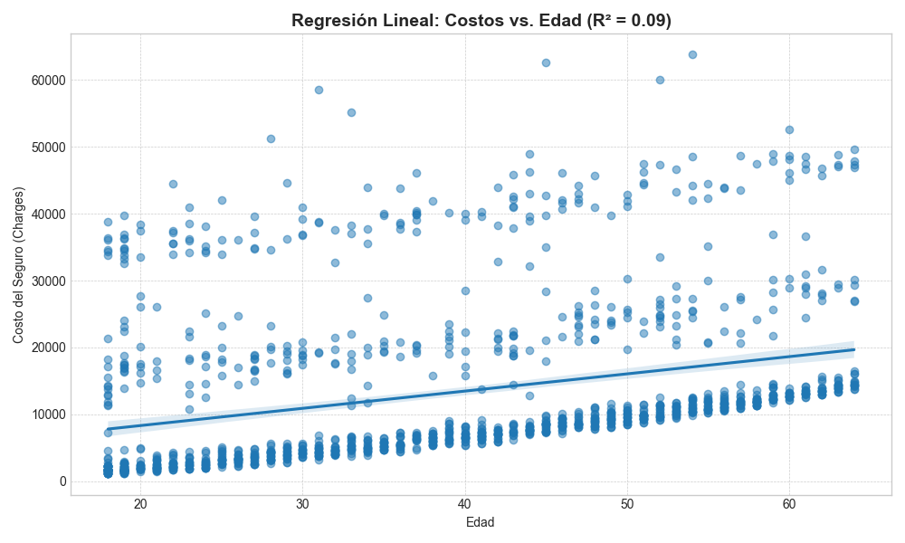
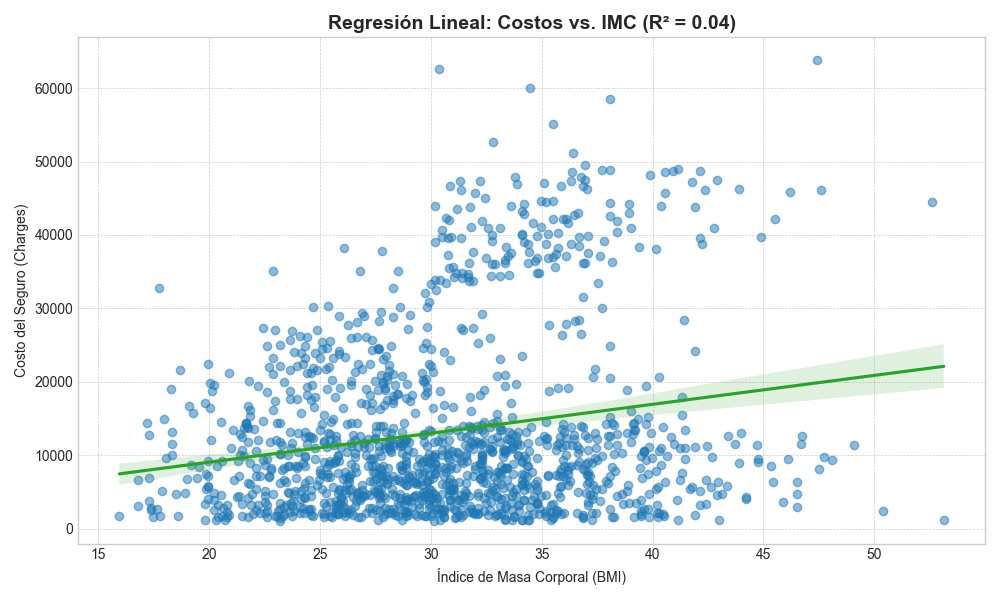
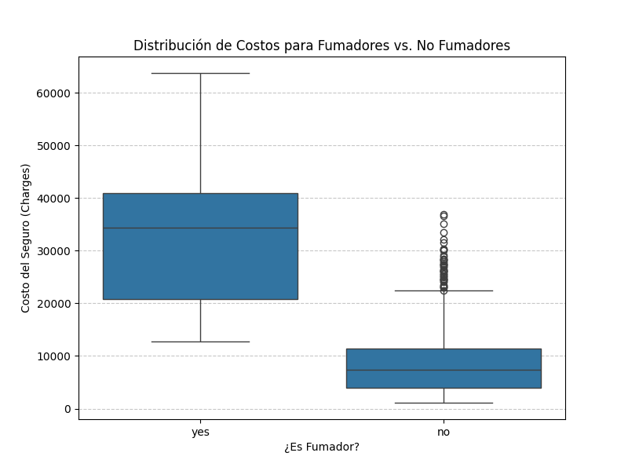
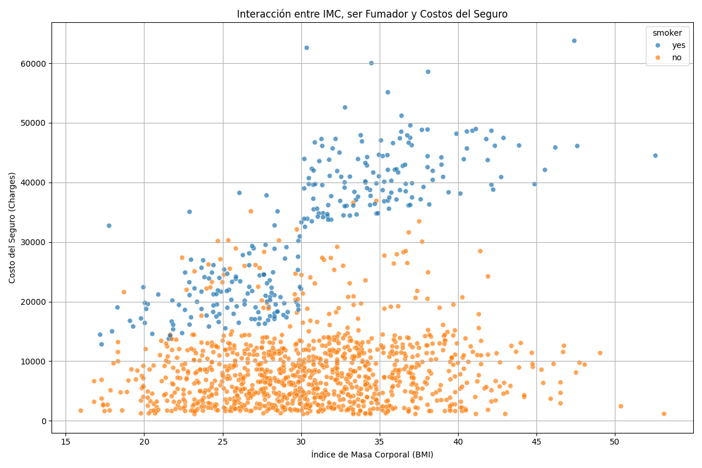
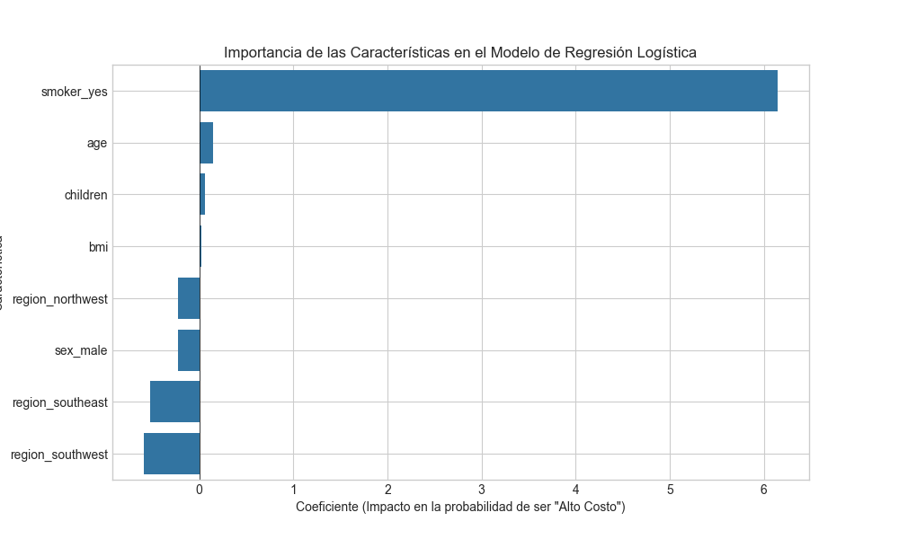
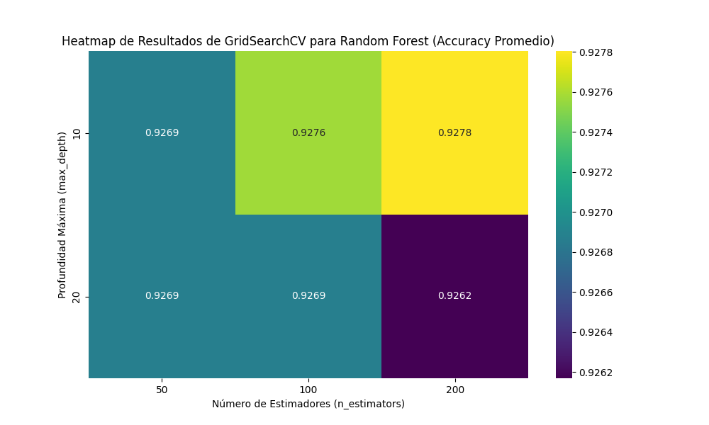
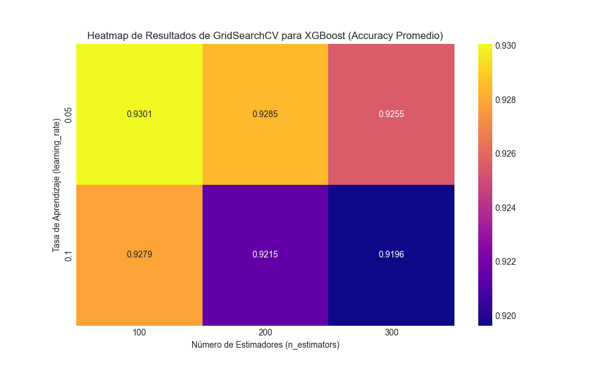
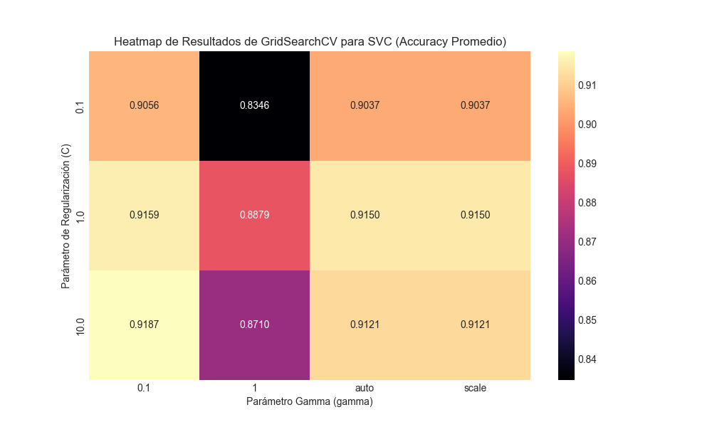

<h1 align="center">🏥 Medical Cost Prediction 🏥</h1>

[](https://kedro.org)

## 🎯 Visión General

Este proyecto Kedro implementa un pipeline de ciencia de datos de extremo a extremo para predecir los costos de seguros médicos y clasificar a los pacientes en categorías de costo. La solución utiliza el conjunto de datos "Medical Insurance Cost Dataset", disponible en [Kaggle](https://www.kaggle.com/datasets/mosapabdelghany/medical-insurance-cost-dataset), que contiene información demográfica y de salud de individuos. El pipeline ingiere estos datos crudos, los procesa para garantizar su calidad, entrena y evalúa modelos de regresión para predecir costos exactos, y modelos de clasificación para predecir si un paciente incurrirá en costos "Altos" o "Bajos".

El objetivo es demostrar un flujo de trabajo de Machine Learning estructurado y reproducible, donde cada paso, desde la limpieza de datos hasta la generación de reportes, está encapsulado en un pipeline modular y robusto.

---

## Hipótesis

La hipótesis central de este análisis es que **factores demográficos y de salud pueden ser utilizados para predecir los costos de seguros médicos y clasificar a los pacientes por riesgo de costo**. Se espera que, mediante algoritmos de regresión y clasificación, se puedan construir modelos capaces de estimar los costos y distinguir con alta precisión entre pacientes de "alto" y "bajo" costo, basándose en características como la edad, el IMC, el hábito de fumar, etc.

---
## Estructura del Proyecto
<div align="center">

```
src/medicalcost/pipelines/
├── data_engineering/     # 1. 📥 Descarga y carga de datos crudos desde Kaggle.
│
├── data_processing/      # 2. 🧼 Limpieza, validación y conversión de tipos de datos.
│
├── model_regression/     # 3. 📈 Entrenamiento y evaluación del modelo de Regresión Lineal.
│   │                     #    - Predice el costo exacto del seguro.
│   │                     #    - Genera reportes y gráficos de regresión.
│   └─ nodes.py
│
└── model_classification/ # 4. 📊 Entrenamiento y evaluación de modelos de Clasificación.
    │                     #    - Predice si el costo será 'Alto' o 'Bajo'.
    │                     #    - Compara Regresión Logística, SVC, XGBoost y Random Forest.
    │                     #    - Optimiza hiperparámetros con GridSearchCV.
    └─ nodes.py
```
</div>

---

## ⚙️ Preparación de Datos

*   **Manejo de Datos Nulos**: El pipeline identifica y elimina sistemáticamente registros con valores faltantes para asegurar la calidad del dataset.
*   **Codificación de Variables Categóricas**: Se transformaron variables como `sex`, `smoker` y `region` en formatos numéricos (One-Hot Encoding) para que los modelos pudieran procesarlas.
*   **Creación de Variable Objetivo para Clasificación**: Se transformó la variable `charges` en una variable binaria `cost_category` ('Alto'/'Bajo') para el problema de clasificación, utilizando la mediana como umbral.
*   **Automatización del Flujo de Datos**: Al encapsular todo el proceso en pipelines de Kedro, se garantiza que los datos para el modelado sean completamente automatizados y reproducibles.

---

## 💡 Resultados del Modelo

Esta sección presenta las conclusiones detalladas y los artefactos generados por los pipelines de Kedro, que encapsulan el proceso de modelado predictivo para la regresión de costos y la clasificación de categorías de costo. Hemos realizado un análisis comparativo exhaustivo de múltiples modelos, incluyendo un riguroso ajuste de hiperparámetros para los modelos de clasificación mediante **validación cruzada K-Fold (Stratified K-Fold)**.

### Modelos de Regresión

El modelo de Regresión Lineal Múltiple entrenado en el pipeline `model_regression` obtuvo un **R-cuadrado de 0.7836**.

**Impacto de cada variable en el costo:**
*   **`smoker_yes`**: Es, por un margen enorme, el factor más determinante. Aumenta el costo en **+$23,600**.
*   **`age`** y **`bmi`**: Son los siguientes factores más importantes, aumentando el costo en **+$257** y **+$337** por cada unidad, respectivamente.
*   **`children`**: También tiene un impacto positivo notable (+$474 por hijo).
*   **`sex_male`** y la **`region`**: Tienen un impacto mucho menor y, en algunos casos, negativo.

### Modelos de Clasificación: Random Forest es el Modelo con Mejor Rendimiento

Tras el ajuste de hiperparámetros, el modelo **Random Forest** demostró ser el más efectivo para la clasificación de costos:

| Modelo | Accuracy (Precisión Final) |
| :--- | :---: |
| Regresión Logística | 89.93% |
| Support Vector Classifier (SVC) | 92.54% |
| XGBoost | 92.91% |
| **Random Forest** | **94.03%** |

> 🏆 El modelo **Random Forest optimizado** es el campeón indiscutible de este análisis, logrando la mayor precisión.
---
### 📊 Visualización de Resultados

Los pipelines generan diversas visualizaciones para entender el comportamiento de los datos y el rendimiento de los modelos.

**Gráficos de Regresión Univariada y Correlación:**
*   **Regresión Lineal: Costos del Seguro vs. Edad**: Muestra una tendencia positiva, con datos agrupados en "bandas" (explicadas por el hábito de fumar).
    
*   **Regresión Lineal: Costos del Seguro vs. IMC (BMI)**: Relación positiva más débil y dispersa.
    
*   **Distribución de Costos para Fumadores vs. No Fumadores**: Revela una diferencia masiva en costos, siendo el hábito de fumar un factor clave.
    
*   **Interacción entre IMC, ser Fumador y Costos del Seguro**: Muestra cómo el IMC impacta drásticamente los costos para fumadores, un claro efecto de interacción.
    
*   **Matriz de Correlación de Variables Numéricas**: Confirma las correlaciones entre `age`, `bmi` y `charges`.
    

**Gráficos de Clasificación y Ajuste de Hiperparámetros:**
*   **Importancia de las Características en el Modelo de Regresión Logística**: Muestra el impacto de cada variable en la clasificación.
    
*   **Heatmap de Resultados de GridSearchCV para Random Forest**: Visualiza el impacto de los hiperparámetros en la precisión del modelo Random Forest.
    
*   **Heatmap de Resultados de GridSearchCV para XGBoost**: Visualiza el impacto de los hiperparámetros en la precisión del modelo XGBoost.
    
*   **Heatmap de Resultados de GridSearchCV para SVC**: Visualiza el impacto de los hiperparámetros en la precisión del modelo SVC.
    

---

**En resumen:** El **Random Forest** es el modelo recomendado para la clasificación de costos médicos en este proyecto, debido a su consistente y superior rendimiento en términos de precisión después de un riguroso ajuste de hiperparámetros. El análisis de regresión también confirmó la importancia crítica de factores como el hábito de fumar, la edad y el IMC en la determinación de los costos.

---

## 🔑 Configuración de Kaggle

Para poder ejecutar este pipeline, es necesario configurar las credenciales de la API de Kaggle.

1.  **Crea un token de API en Kaggle:**
    *   Ve a tu perfil de Kaggle y entra en la sección "Settings": [https://www.kaggle.com/settings](https://www.kaggle.com/settings)
    *   En la sección "API", haz clic en **"Create New Token"**. Se descargará un archivo llamado `kaggle.json`.

2.  **Coloca el archivo de credenciales:**
    *   Mueve el archivo `kaggle.json` a la carpeta `.kaggle` dentro de tu directorio de usuario.
        *   En Windows: `C:\Users\<Tu-Usuario>\.kaggle\kaggle.json`
        *   En Linux/macOS: `~/.kaggle/kaggle.json`

Una vez completados estos pasos, el pipeline podrá autenticarse con Kaggle para descargar los datos necesarios.

---

## 🚀 Instalación y Ejecución

Sigue estos pasos para configurar y ejecutar el proyecto en tu máquina local. Se requiere Python 3.11.9.

### 1. Clonar el Repositorio

Primero, clona este repositorio.

```bash
git clone https://github.com/J-Lopez-IICG/MedicalCostKedro.git
cd MedicalCostKedro-WorkInProgress
```

### 2. Crear y Activar un Entorno Virtual

Es una práctica recomendada utilizar un entorno virtual para aislar las dependencias del proyecto.

```bash
# Crear el entorno virtual
python -m venv venv

# Activar en Windows (PowerShell)
.\venv\Scripts\Activate.ps1

# Activar en macOS/Linux
# source venv/bin/activate
```

### 3. Instalar Dependencias

Una vez que el entorno virtual esté activado, instala todas las librerías necesarias.

```bash
pip install -r requirements.txt
```

### 4. Ejecutar el Pipeline

Con las dependencias instaladas, puedes ejecutar el pipeline completo con un solo comando.

```sh
kedro run
```

Esto ejecutará todos los nodos en secuencia, generando los datos limpios, los modelos entrenados y las gráficas de resultados en la carpeta `data/`.

---

## 📓 Desarrollo con Notebooks

La carpeta `notebooks` contiene los Jupyter Notebooks utilizados durante la fase de exploración y desarrollo.

Para trabajar con ellos de forma interactiva dentro del contexto de Kedro, ejecuta:

```bash
kedro jupyter lab
# o también
kedro jupyter notebook
```

> **Nota**: Al usar estos comandos, Kedro inicia el notebook con las variables `context`, `session`, `catalog` y `pipelines` ya cargadas, facilitando la interacción con los datos y funciones del proyecto.
